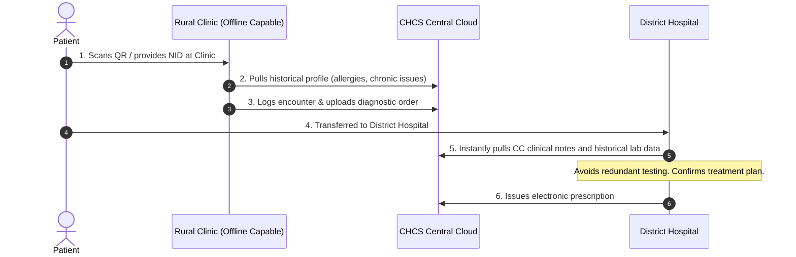

# DOCUMENT 02: NATIONAL DIGITAL HEALTH TRANSFORMATION BLUEPRINT

**Purpose:** This document serves as the master strategic and policy framework for the Government of Bangladesh, specifically the Ministry of Health and Family Welfare (MoHFW) and the ICT Division. It outlines the strategic vision, governance models, policy alignment, and operational frameworks required to transition Bangladesh's healthcare system from a fragmented, paper-based model to a unified digital ecosystem.
**Intended Audience:** Cabinet Ministers, Policy Makers, Health Ministry Directors, Development Partners (World Bank, WHO), and Digital Health Executives.
**Why it matters:** Technology is only 20% of a digital transformation initiative; the remaining 80% is policy, process, governance, change management, and human capital. This blueprint addresses the non-technical foundations required to ensure the long-term adoption, legality, and sustainability of the CHCS.

---

## 1. Executive Summary

The healthcare system of Bangladesh stands at a critical juncture. Despite notable achievements in maternal and child health and immunization coverage, the system remains plagued by structural fragmentation, lack of longitudinal patient records, and severe data silos. The Centralized Health Care System (CHCS) represents a comprehensive digital framework designed to unify public and private healthcare facilities on a single, secure, and interoperable digital backbone. 

This blueprint details the transformation strategy, starting with a 6-month pilot in the Sylhet division, followed by a phased nationwide rollout. By leveraging the existing National Identity (NID) infrastructure, enforcing HL7/FHIR interoperability standards, and establishing a robust governance framework, CHCS aims to deliver lifetime electronic health records (EHR) to every citizen, reduce redundant healthcare expenditure by 22%, and enable real-time, data-driven public health surveillance.

---

## 2. Vision and Mission

### Vision
To establish a world-class, resilient, and inclusive digital healthcare ecosystem that guarantees every citizen of Bangladesh secure access to their lifelong medical history, improving health outcomes and achieving Universal Health Coverage (UHC) by 2040.

### Mission
*   **Interoperability:** Build the digital highway connecting all public and private health facilities.
*   **Citizen Empowerment:** Put patients in control of their health data.
*   **Data-Driven Policy:** Provide policy-makers with real-time epidemiological and operational metrics.
*   **Efficiency:** Eliminate duplicate diagnostics, reduce administrative overhead, and optimize national resource allocation.

---

## 3. National Healthcare System Analysis

### Current State Analysis
Bangladesh's healthcare delivery is highly decentralized, consisting of three main sectors:
1.  **Public Sector:** Community clinics (rural), Upazila Health Complexes, District Hospitals, and Medical College Hospitals.
2.  **Private Sector:** Elite urban hospitals, specialized clinics, diagnostic labs, and retail pharmacies.
3.  **NGO Sector:** Primary care providers in urban slums and remote areas.

```
+--------------------------------------------------------------------------+
|                        CURRENT FRAGMENTED STATE                          |
+--------------------------------------------------------------------------+
|  [Community Clinic]    [Private Lab]      [Medical College]   [Pharmacy] |
|   (Paper Records)     (Isolated PDF)      (Local Proprietary)  (No Log)  |
+--------------------------------------------------------------------------+
                                     |
                                     v
                        NO CENTRAL PATIENT PORTFOLIO
                        - Diagnostic Redundancy (20-30%)
                        - Lost Medical History
                        - Inability to Track Epidemics Real-Time
```

### Key Vulnerabilities
*   **Out-of-Pocket Expenditure (OOPE):** Citizens bear 69% of healthcare costs, with a significant portion spent on repeating diagnostic tests because previous records are lost or unavailable.
*   **Referral System Failure:** Patients jump directly to tertiary care facilities (Dhaka Medical, Mymensingh Medical) for minor ailments, overwhelming the system. Without centralized records, triage and referral pathways cannot be enforced.
*   **Epidemic Data Latency:** Public health officials rely on retrospective, paper-based reporting, delaying responses to outbreaks like Dengue or Cholera by weeks.

---

## 4. Stakeholder Mapping

To succeed, CHCS must align the incentives of highly diverse stakeholders:

| Stakeholder Group | Primary Incentive | Key Concerns | Mitigation Strategy |
|---|---|---|---|
| **MoHFW & Government** | Public health improvement, UHC targets, resource optimization. | Budget overruns, political risk, adoption failure. | Phased rollout, transparent KPI dashboards, international donor funding. |
| **Private Hospitals** | Operational efficiency, attracting premium patients, regulatory compliance. | IP loss, system replacement costs, data leakage. | Interoperability via API (keep their existing HMIS), strict data-siloing rules. |
| **Doctors / Clinicians** | Quick access to records, reduced clerical work. | Increased screen time, UX complexity. | Intuitive interface, integration with BMDC directory, auto-population features. |
| **Citizens / Patients** | Portability of records, cost savings, ease of access. | Privacy, data misuse, lack of tech access. | Free basic access, secure NID integration, USSD/SMS query capabilities for non-smartphone users. |
| **Pharmacies** | Quick verification of prescriptions, inventory tracking. | System complexity, audit trail exposure. | Minimalist portal (exposing only dosage/medicine name, zero clinical history), POS integration. |

---

## 5. Patient Journey Transformation

### The Current Journey
```mermaid
sequenceDiagram
    autonumber
    actor Patient
    participant CC as Rural Clinic
    participant DH as District Hospital
    participant Lab as Private Diagnostic
    
    Patient->>CC: 1. Attends with fever
    Note over CC: Records symptoms on paper register
    CC->>Patient: 2. Gives handwritten prescription
    Patient->>DH: 3. Condition worsens; travels to District Hospital
    Note over DH: Has no access to Rural Clinic notes
    DH->>Lab: 4. Orders blood tests (redundant)
    Lab->>Patient: 5. Delivers paper report
    Patient->>DH: 6. Returns with report; receives new prescription
    Note over Patient: Paper reports are lost during return travel
```

### The Transformed Journey (CHCS Enabled)


---

## 6. Digital Transformation Strategy

The transformation strategy relies on four core pillars:

### 1. Unified Identity Resolution
By utilizing existing identifiers (NID, Passport, Birth Registration) as primary keys, CHCS maps every record to a Single Patient Identifier (SPI) without requiring new physical hardware cards.

### 2. Zero-Knowledge Data Siloing
Unlike legacy systems that aggregate full medical histories into single accessible pools, CHCS partitions data:
*   **Clinical Records:** Stored in siloed, encrypted files accessed only via OAuth 2.0 dynamic consents.
*   **Pharmacy Records:** Isolated such that dispensaries only pull active prescriptions (dosages, quantities) and never see underlying clinical notes, diagnoses, or family history.

### 3. Open Interoperability Standards
CHCS mandates **FHIR (Fast Healthcare Interoperability Resources)** APIs. Existing hospital management software (HMIS) must expose compatible endpoints to maintain licensing with the Directorate General of Health Services (DGHS).

---

## 7. Operational Model & Governance

A hybrid public-private partnership (PPP) model will govern CHCS:

```
                  +-----------------------------------+
                  |   National Digital Health Board   |
                  |  (MoHFW, ICT Division, DGHS, NGO) |
                  +-----------------------------------+
                                    |
                                    v
                  +-----------------------------------+
                  |      CHCS Operating Agency        |
                  |     (State-Owned Entity/PPP)      |
                  +-----------------------------------+
                                    |
                  +-----------------+-----------------+
                  |                                   |
                  v                                   v
       [Technical Operations]             [Clinical Governance]
       - Infrastructure & DevOps          - Data Standards (FHIR)
       - Cyber Security Audits            - Medical Ethics Board
```

---

## 8. Policy & Legal Framework

To operationalize CHCS, the Government of Bangladesh must introduce or update specific policy directives:

1.  **Digital Health Data Security Act:** Enact a localized version of GDPR/HIPAA, establishing clear penalties for unauthorized access to patient records.
2.  **Electronic Prescription Directive:** Legally validate electronic prescriptions signed with digital certificates, allowing pharmacies to dispense medication without physical paper.
3.  **Interoperability Mandate:** Require all private hospitals to achieve CHCS integration within 24 months as a condition for annual license renewal.

---

## 9. Implementation Roadmap

```
+---------------------------------------------------------------------------------------+
|                                  IMPLEMENTATION TIMELINE                              |
+---------------------------------------------------------------------------------------+
| PHASE 1: PILOT (Months 1-6)        PHASE 2: REGIONAL (Months 7-18)  PHASE 3: NATIONAL (Y2+) |
| - Sylhet Division Rollout          - Cover 8 Divisional Cities      - Enlist All 64 Districts|
| - Connect 2 Public/5 Private       - Integrate 150+ Hospitals       - 100M+ Citizen UHIDs    |
| - Validate Offline Sync            - Establish National Health Hub  - Open API for Insurances|
+---------------------------------------------------------------------------------------+
```

---

## 10. Monitoring, KPIs, and Success Metrics

The National Digital Health Board will monitor implementation through the following metrics:

| Metric Category | Key Performance Indicator (KPI) | Baseline (Current) | Target (Year 3) |
|---|---|---|---|
| **Financial** | Redundant diagnostic test rate | Estimated 32% | < 5% |
| **Operational** | Patient registration time | > 15 minutes | < 2 minutes (QR Scan) |
| **Clinical** | Medical history availability at point of care | < 10% | > 95% |
| **Public Health** | Infectious disease outbreak notification latency | 10–14 days | < 6 hours (Real-time GIS) |
| **Adoption** | Active user base (UHID registered) | 0 | 100 Million+ |
