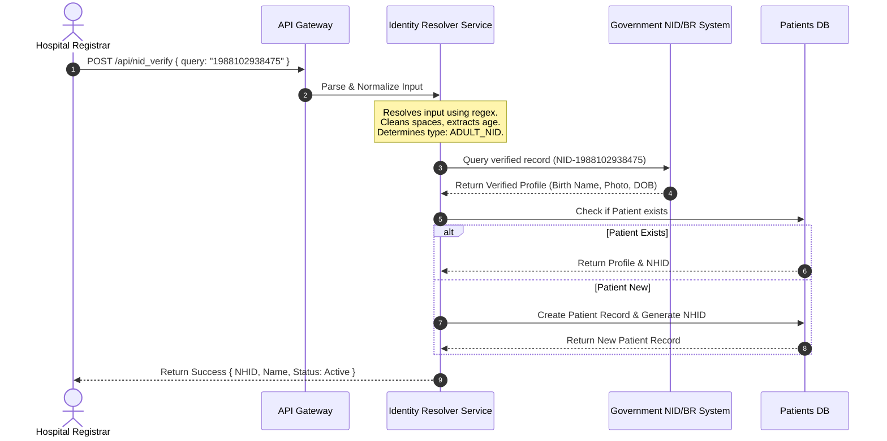

# DOCUMENT 03: ENTERPRISE SOFTWARE ARCHITECTURE DOCUMENT

**Purpose:** This document details the production-ready software engineering, deployment, and security architecture of the Centralized Health Care System (CHCS). It provides enterprise software architects, tech leads, systems integrators, and security officers with a detailed roadmap for building, scaling, and auditing the system.
**Intended Audience:** CTOs, Lead Developers, DevOps Engineers, Cyber Security Officers, and Vendor Integration Teams.
**Why it matters:** National digital infrastructure requires meticulous system design. This architecture ensures high availability (99.99% uptime), data confidentiality (HIPAA/GDPR alignment), and rapid system integration with public and private legacy portals across Bangladesh.

---

## 1. System Context Diagram (C4 Model - Level 1)

```
                       +---------------------------------------+
                       |                 CHCS                  |
                       |       (Centralized Platform)          |
                       +---------------------------------------+
                        /          |               |          \
                       /           |               |           \
                      v            v               v            v
        +---------------+  +---------------+  +---------------+  +---------------+
        |  Doctor App   |  |  Patient App  |  |  Pharmacy POS |  | Ministry Dash |
        |  (Clinical)   |  | (Health Portfolio)| (Dispensaries)|  | (Analytics)   |
        +---------------+  +---------------+  +---------------+  +---------------+
              |                    |                  |                  |
              +--------------------+------------------+------------------+
                                           |
                                           v
                              +--------------------------+
                              |    CHCS API Gateway      |
                              +--------------------------+
                                           |
                    +----------------------+----------------------+
                    |                      |                      |
                    v                      v                      v
        +-----------------------+  +-----------------------+  +-----------------------+
        |   Identity Registry   |  |   EHR Storage Service |  |   Outbreak Engine     |
        |   (NID / BR / PASS)   |  |   (FHIR Document DB)  |  |   (Real-time GIS)     |
        +-----------------------+  +-----------------------+  +-----------------------+
```

---

## 2. Container Diagram (C4 Model - Level 2)

```
[Web/Mobile Clients] --(HTTPS/WSS)--> [Kong API Gateway]
                                             |
                   +-------------------------+-------------------------+
                   | (OAuth 2.0 Auth Checks) |                         |
                   v                         v                         v
        +---------------------+   +---------------------+   +---------------------+
        |  Identity Resolver  |   |   Clinical EHR      |   |   Notification Hub  |
        |  (Python/FastAPI)   |   |   (Go/Microservice) |   |   (Node.js/WebSockets)|
        +---------------------+   +---------------------+   +---------------------+
                   |                         |                         |
                   v                         v                         v
        +---------------------+   +---------------------+   +---------------------+
        |  National NID API   |   |  MongoDB/Postgres   |   |   Redis Pub/Sub &   |
        |  (External Secure)  |   |   (Encrypted EHR)   |   |   Kafka Message Bus |
        +---------------------+   +---------------------+   +---------------------+
```

---

## 3. Database Strategy & ER Diagram

For development, CHCS utilizes a localized SQLite store (`nchds.db`). In production, this shifts to a distributed PostgreSQL database (hosted on Supabase or AWS RDS) with write-master and geo-distributed read replicas to ensure minimal latency in divisional centers.

### Entity Relationship Model
```
  +------------------+          +------------------+          +------------------+
  |    patients      |          |    doctors       |          |    hospitals     |
  +------------------+          +------------------+          +------------------+
  | PK  id           |<---+     | PK  id           |<---+     | PK  id           |<---+
  |     nhid (Unique)|    |     |     name         |    |     |     name         |    |
  |     nid (Unique) |    |     |     bmdc_reg     |    |     |     grade        |    |
  |     name         |    |     |     specialty    |    |     |     division     |    |
  +------------------+    |     +------------------+    |     +------------------+    |
                          |                             |                             |
                          |     +------------------+    |                             |
                          |     |    encounters    |    |                             |
                          |     +------------------+    |                             |
                          +-----| FK  patient_id   |    |                             |
                                | FK  doctor_id    |----+                             |
                                | FK  hospital_id  |----------------------------------+
                                |     diagnosis    |
                                |     timestamp    |
                                +------------------+
                                         |
                                         v
                                +------------------+
                                |  prescriptions   |
                                +------------------+
                                | PK  id           |
                                | FK  encounter_id |
                                |     generic_name |
                                |     dosage       |
                                |     quantity     |
                                |     dispensed    |
                                +------------------+
```

---

## 4. Identity Resolution Sequence (Prefix-Free Resolver)

This sequence diagram outlines how the system automatically resolves identity from user input:



---

## 5. Security & RBAC Architecture

To protect citizen data, CHCS implements strict **Role-Based Access Control (RBAC)** at the API Gateway level.

### Zero-Knowledge Pharmacy Endpoint Strategy
*   **The Problem:** Traditional systems return the entire patient object, letting pharmacists see clinical diagnoses, medical history, and family details.
*   **The CHCS Solution:** The pharmacy dashboard calls `/api/pharmacy_prescriptions` instead of `/api/search_patient`.
*   **Data Silo Enforcement:** The API dynamically filters out clinical attributes, returning only:
    *   `patient_name`, `nhid`
    *   `generic_name`, `brand_name`, `dosage`, `quantity`, `dispensed`
*   **Audit Logging:** Every query to this endpoint logs the requesting pharmacy ID, timestamp, and accessed patient ID in an immutable write-only audit trail (PostgreSQL with WAL archiving).

```
[Pharmacy POS] --(Requests Prescription)--> [/api/pharmacy_prescriptions]
                                                      |
                                                      v
                                        [Data Silo Filtering Engine]
                                        - Excludes: Diagnosis, Symptoms, Notes
                                        - Includes: Med Name, Dosage, Qty Only
                                                      |
                                                      v
                                            [Filtered JSON Response]
```

---

## 6. Microservices & Event-Driven Architecture

CHCS processes high volumes of concurrent requests through an asynchronous event-driven design:

*   **API Gateway:** Kong API Gateway handles routing, rate-limiting, SSL termination, and OAuth 2.0 verification.
*   **Message Broker (Apache Kafka):** High-throughput telemetry, such as outbreak event updates or clinical audit logs, are written to Kafka topics.
*   **Cache Layer (Redis):** Session tokens, patient profile summaries, and national statistics are cached with a 15-minute Time-To-Live (TTL) to reduce database load.

```
                  +-----------------------------------+
                  |             Kong API Gateway      |
                  +-----------------------------------+
                                    |
            +-----------------------+-----------------------+
            | (Sync)                                        | (Async Event)
            v                                               v
  +-------------------+                           +-------------------+
  |  EHR Microservice |                           | Kafka Event Bus   |
  +-------------------+                           +-------------------+
            |                                               |
            v                                       +-------+-------+
    [Postgres DB]                                   v               v
                                            [Outbreak GIS]   [Audit Logging]
```

---

## 7. Cloud Deployment & DevOps Strategy

### Containerization & Orchestration
*   All microservices are packaged as lightweight Docker containers.
*   Production orchestration uses **Kubernetes (EKS/GKE)** deployed across multiple zones.

### Deployment & CI/CD Pipeline
1.  **Code Commit:** Developer pushes to GitHub.
2.  **Statical Analysis:** GitHub Actions runs linting and unit tests.
3.  **Docker Build:** Build Docker images and scan for vulnerabilities using Trivy.
4.  **Staging Deployment:** Auto-deploy to Staging cluster.
5.  **Production Release:** Deploy using **Blue-Green** deployment strategy to ensure zero downtime. If smoke tests fail, traffic is instantly rolled back to the Green cluster.

---

## 8. Resiliency & Disaster Recovery

### Offline-First Rural Syncing
In clinics with unstable internet connectivity, CHCS deploys a local Docker container running an offline cache database (PouchDB/SQLite).
*   **Offline Mode:** Clinical encounters are saved locally with UUIDs.
*   **Online Sync:** When connectivity resumes, a background worker pushes changes to the central queue using conflict resolution rules (e.g., Doctor timestamp overrides local entries).

### Disaster Recovery
*   **RPO (Recovery Point Objective):** 5 minutes (via continuous database WAL archiving).
*   **RTO (Recovery Time Objective):** 15 minutes (via automated multi-region DNS failover).
*   **Backups:** Daily encrypted snapshots stored in secure, geographically isolated S3 buckets.
