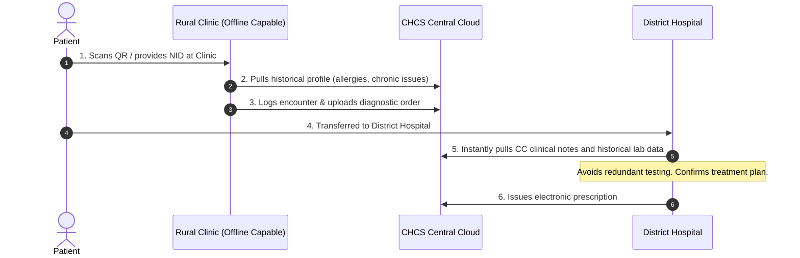
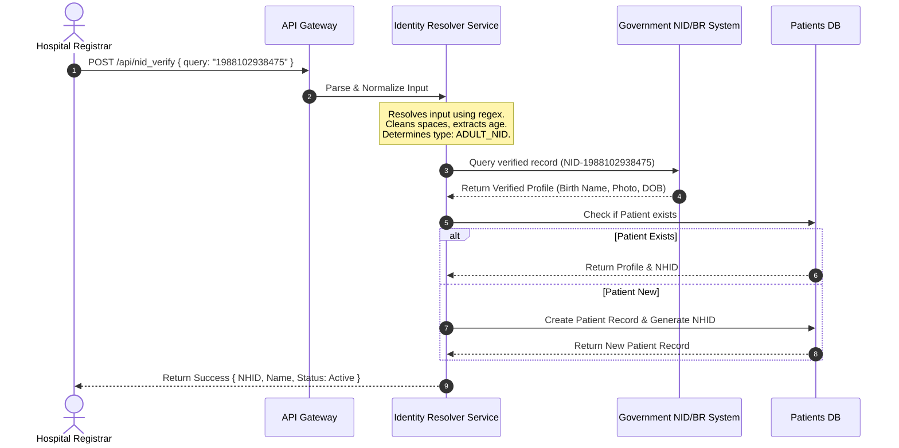

# DOCUMENT 01: EXECUTIVE PITCH DECK

**Purpose:** To serve as the primary persuasive instrument for securing buy-in, funding, and partnerships for the Centralized Health Care System (CHCS) in Bangladesh. This document translates complex systemic problems and technical architecture into a compelling narrative of national transformation.
**Intended Audience:** High-level stakeholders including Ministry of Health and Family Welfare (MoHFW) officials, Tier-1 Venture Capitalists, Corporate Partners (e.g., Telecoms, ISPs), NGOs (e.g., WHO, World Bank), and key healthcare executives.
**Why it matters:** In major transformation initiatives, decision-makers rarely engage with the technical minutiae initially. They need a clear, high-impact overview that articulates the "Why now?", the feasibility of the solution, the financial/social ROI, and the mitigate-able risks. This deck bridges the gap between vision and execution.

---

## Slide 1: Title Slide
**Title:** CHCS: Centralized Health Care System
**Subtitle:** Digitizing the Healthcare Backbone of Bangladesh for 170 Million Citizens
**Presenter:** [Founder/Consortium Lead Name]
**Date:** [Current Date]

*Speaker Notes:* Welcome the stakeholders. Establish gravity. This is not just a software project; this is a critical infrastructure initiative comparable to the national ID or mobile financial services (MFS) rollout.

## Slide 2: The Core Problem – A Fragmented Reality
**Headline:** Bangladesh’s Healthcare is Growing, But Disconnected
**Content:**
*   **Data Silos:** A patient moving from a village community clinic to Dhaka Medical College loses their entire medical history. Diagnosis starts from scratch.
*   **Wasted Resources:** Redundant testing costs citizens millions annually and wastes critical diagnostic bandwidth.
*   **Epidemic Blind Spots:** Without real-time, centralized data, responses to outbreaks (Dengue, Nipah virus) are reactive, not predictive.
*   **Lack of Accountability:** Malpractice and misdiagnosis are difficult to track without an immutable audit trail.

*Speaker Notes:* Ground the problem in a human reality. Mention a specific scenario: "Imagine a patient traveling from Rajshahi to Dhaka for specialized care. Their local doctor's notes, previous prescriptions, and lab results are lost. The new doctor operates blind." 

## Slide 3: The Market Opportunity & Imperative
**Headline:** A Ripe Ecosystem for Digital Transformation
**Content:**
*   **Mobile Penetration:** Over 180M mobile subscribers; vast adoption of mobile internet.
*   **Digital Bangladesh to Smart Bangladesh:** Aligning perfectly with the government's Vision 2041.
*   **Market Size:** Healthcare expenditure in Bangladesh is rapidly growing, yet digital infrastructure spend remains disproportionately low.
*   **The MFS Precedent:** Just as bKash revolutionized financial inclusion, CHCS will revolutionize healthcare inclusion.

*Speaker Notes:* Emphasize that the timing is perfect. The infrastructure (4G, smartphones) is there; the missing piece is the unifying healthcare platform.

## Slide 4: The Solution – CHCS
**Headline:** One Identity. One Record. A Lifelong Health Journey.
**Content:**
*   **Universal Health Identity (UHID):** Tied seamlessly to the existing National ID (NID) and Birth Registration (BR) systems. No new cards needed.
*   **Interoperable Ecosystem:** Connecting public hospitals, private clinics, diagnostic centers, and pharmacies on a single, secure network.
*   **Patient-Centric Access:** Citizens control and access their health records via a secure mobile interface or USSD (for low-tech areas).

*Speaker Notes:* Highlight the simplicity for the user. "We are not reinventing the ID; we are unlocking its potential in healthcare."

## Slide 5: High-Level Architecture (The Engine)
**Headline:** Built for National Scale and Zero Downtime
**Content:**
*   *Visual: A simplified architectural diagram (Mermaid/ASCII).*
*   **Hybrid Cloud Infrastructure:** Leveraging local sovereign clouds for data residency compliance, backed by highly available, scalable compute.
*   **API-First & Microservices:** Ensuring rapid integration with existing hospital management systems (HMIS) via HL7/FHIR standards.
*   **Edge Computing for Low Connectivity:** Offline-first capabilities for rural clinics; syncing when connectivity resumes.
*   **Bank-Grade Security:** End-to-end encryption, strict Role-Based Access Control (RBAC).

*Speaker Notes:* Reassure the technical and governmental stakeholders that this is built to enterprise standards. It's resilient against power and internet outages common in rural areas.

## Slide 6: The Clinical & Public Health Impact
**Headline:** From Reactive Treatment to Proactive Care
**Content:**
*   **For Doctors:** Instant access to longitudinal patient histories. Better data = better outcomes.
*   **For Hospitals:** Streamlined workflows, reduced administrative burden, optimized resource allocation.
*   **For the Ministry (MoHFW):** A real-time national dashboard. AI-driven early warning systems for epidemic outbreaks (e.g., heat maps of fever/dengue symptoms).

*Speaker Notes:* Focus on the macro-benefits. "For the first time, the Ministry will have a live pulse of the nation's health, allowing for targeted resource deployment."

## Slide 7: Pilot Strategy – The Proving Ground
**Headline:** Phased Rollout: De-risking Implementation
**Content:**
*   **Phase 1 (Month 1-6):** Controlled pilot in one division (e.g., Sylhet). Connecting 2 public hospitals, 5 private clinics, and 50 pharmacies.
*   **Phase 2 (Month 7-12):** Regional expansion and integration with initial government health registries.
*   **Phase 3 (Year 2):** Nationwide phased rollout.

*Speaker Notes:* Address the implementation risk head-on. We are not turning on a switch for 170 million people on day one. We test, refine, and scale.

## Slide 8: Business & Sustainability Model
**Headline:** A Commercially Viable Public Good
**Content:**
*   **B2G (Business to Government):** Licensing/SaaS fees for national deployment and public health analytics dashboards.
*   **B2B (Business to Business):** Subscription models for private hospitals, diagnostic centers, and pharmacies for API access and premium features.
*   **B2C (Business to Consumer):** Basic access is free (fundamental right). Premium services (telemedicine integration, advanced AI analytics) via subscription.
*   **Data Monetization (Strictly Anonymized):** Providing aggregate, anonymized epidemiological data to pharmaceutical companies and researchers (compliant with all privacy laws).

*Speaker Notes:* Explain that while this serves a public good, it must be financially self-sustaining to survive.

## Slide 9: Implementation Timeline & Roadmap
**Headline:** A Clear Path to Nationwide Adoption
**Content:**
*   *Visual: A high-level timeline chart.*
*   **Q1-Q2:** Core platform development, security auditing, API finalization.
*   **Q3-Q4:** Pilot launch, user feedback loop, system iteration.
*   **Year 2:** Regional scaling, onboarding major private hospital chains.
*   **Year 3+:** Nationwide saturation, integration of advanced AI diagnostic tools.

*Speaker Notes:* Show that we have a realistic, measured timeline.

## Slide 10: Budget Request & Use of Funds
**Headline:** Fueling the Transformation
**Content:**
*   **Total Ask:** [$X Million USD / BDT]
*   **Allocation:**
    *   40% - Engineering & Infrastructure (Cloud, DevOps, Security)
    *   30% - Operations & Implementation (On-ground training, hardware deployment)
    *   20% - Partnerships & Go-to-Market (Marketing, stakeholder engagement)
    *   10% - Contingency & Legal

*Speaker Notes:* Be transparent about where the money goes. Emphasize that the bulk is for robust engineering and on-the-ground implementation, which are the hardest parts.

## Slide 11: The National Impact (ROI)
**Headline:** Beyond Financial Returns
**Content:**
*   **Economic:** Billions of Taka saved annually in redundant testing and administrative inefficiencies.
*   **Social:** Democratized access to quality care; rural citizens receive the same standard of record-keeping as urban elites.
*   **Strategic:** Positioning Bangladesh as a global leader in national digital health infrastructure.

*Speaker Notes:* End the presentation on a high, aspirational note. This is legacy-building work.

## Slide 12: Call to Action
**Headline:** Join Us in Building the Future of Health
**Content:**
*   "We are seeking visionary partners to pilot, fund, and scale this vital infrastructure."
*   Contact Information.

---

### Appendix: Q&A Preparation (For the Presenter)

**Q: How do you handle areas with no internet or frequent power cuts?**
*Strong Answer:* "CHCS is designed with an 'offline-first' architecture at the edge. Local clinics use a lightweight local cache that functions without the internet. Once connectivity is restored, it asynchronously syncs with the central database using conflict-resolution protocols. We also design for low-bandwidth environments (USSD/SMS fallback for basic queries)."

**Q: What about data privacy and the risk of a national breach?**
*Strong Answer:* "Security is our foundational layer, not an afterthought. We employ end-to-end encryption, strict Role-Based Access Control (a pharmacy cannot see a patient's psychiatric history), and immutable audit logs. We align with international standards (HIPAA/GDPR principles) while ensuring data sovereignty within Bangladesh."

**Q: Why would private hospitals adopt this if they already have their own HMIS?**
*Strong Answer:* "We are not replacing their HMIS; we are augmenting it. By providing standard APIs (HL7/FHIR), we act as the interoperability layer. Private hospitals benefit by receiving incoming patients' full histories, improving their care quality and reducing liability. Furthermore, participation will eventually become a regulatory expectation."

**Q: The government moves slowly. How do you plan to get past the bureaucracy?**
*Strong Answer:* "By demonstrating value through a successful, self-funded private-public pilot first. We don't ask the government to build it; we ask them to endorse a working model. We align directly with the 'Smart Bangladesh' mandate, positioning this as a turnkey solution for their policy goals."


---

# DOCUMENT 02: NATIONAL DIGITAL HEALTH TRANSFORMATION BLUEPRINT

**Purpose:** This document serves as the master strategic and policy framework for the Government of Bangladesh, specifically the Ministry of Health and Family Welfare (MoHFW) and the ICT Division. It outlines the strategic vision, governance models, policy alignment, and operational frameworks required to transition Bangladesh's healthcare system from a fragmented, paper-based model to a unified digital ecosystem.
**Intended Audience:** Cabinet Ministers, Policy Makers, Health Ministry Directors, Development Partners (World Bank, WHO), and Digital Health Executives.
**Why it matters:** Technology is only 20% of a digital transformation initiative; the remaining 80% is policy, process, governance, change management, and human capital. This blueprint addresses the non-technical foundations required to ensure the long-term adoption, legality, and sustainability of the CHCS.

---

## 1. Executive Summary

The healthcare system of Bangladesh stands at a critical juncture. Despite notable achievements in maternal and child health and immunization coverage, the system remains plagued by structural fragmentation, lack of longitudinal patient records, and severe data silos. The Centralized Health Care System (CHCS) represents a comprehensive digital framework designed to unify public and private healthcare facilities on a single, secure, and interoperable digital backbone. 

This blueprint details the transformation strategy, starting with a 6-month pilot in the Sylhet division, followed by a phased nationwide rollout. By leveraging the existing National Identity (NID) infrastructure, enforcing HL7/FHIR interoperability standards, and establishing a robust governance framework, CHCS aims to deliver lifetime electronic health records (EHR) to every citizen, reduce redundant healthcare expenditure by 22%, and enable real-time, data-driven public health surveillance.

---

## 2. Vision and Mission

### Vision
To establish a world-class, resilient, and inclusive digital healthcare ecosystem that guarantees every citizen of Bangladesh secure access to their lifelong medical history, improving health outcomes and achieving Universal Health Coverage (UHC) by 2040.

### Mission
*   **Interoperability:** Build the digital highway connecting all public and private health facilities.
*   **Citizen Empowerment:** Put patients in control of their health data.
*   **Data-Driven Policy:** Provide policy-makers with real-time epidemiological and operational metrics.
*   **Efficiency:** Eliminate duplicate diagnostics, reduce administrative overhead, and optimize national resource allocation.

---

## 3. National Healthcare System Analysis

### Current State Analysis
Bangladesh's healthcare delivery is highly decentralized, consisting of three main sectors:
1.  **Public Sector:** Community clinics (rural), Upazila Health Complexes, District Hospitals, and Medical College Hospitals.
2.  **Private Sector:** Elite urban hospitals, specialized clinics, diagnostic labs, and retail pharmacies.
3.  **NGO Sector:** Primary care providers in urban slums and remote areas.

```
+--------------------------------------------------------------------------+
|                        CURRENT FRAGMENTED STATE                          |
+--------------------------------------------------------------------------+
|  [Community Clinic]    [Private Lab]      [Medical College]   [Pharmacy] |
|   (Paper Records)     (Isolated PDF)      (Local Proprietary)  (No Log)  |
+--------------------------------------------------------------------------+
                                     |
                                     v
                        NO CENTRAL PATIENT PORTFOLIO
                        - Diagnostic Redundancy (20-30%)
                        - Lost Medical History
                        - Inability to Track Epidemics Real-Time
```

### Key Vulnerabilities
*   **Out-of-Pocket Expenditure (OOPE):** Citizens bear 69% of healthcare costs, with a significant portion spent on repeating diagnostic tests because previous records are lost or unavailable.
*   **Referral System Failure:** Patients jump directly to tertiary care facilities (Dhaka Medical, Mymensingh Medical) for minor ailments, overwhelming the system. Without centralized records, triage and referral pathways cannot be enforced.
*   **Epidemic Data Latency:** Public health officials rely on retrospective, paper-based reporting, delaying responses to outbreaks like Dengue or Cholera by weeks.

---

## 4. Stakeholder Mapping

To succeed, CHCS must align the incentives of highly diverse stakeholders:

| Stakeholder Group | Primary Incentive | Key Concerns | Mitigation Strategy |
|---|---|---|---|
| **MoHFW & Government** | Public health improvement, UHC targets, resource optimization. | Budget overruns, political risk, adoption failure. | Phased rollout, transparent KPI dashboards, international donor funding. |
| **Private Hospitals** | Operational efficiency, attracting premium patients, regulatory compliance. | IP loss, system replacement costs, data leakage. | Interoperability via API (keep their existing HMIS), strict data-siloing rules. |
| **Doctors / Clinicians** | Quick access to records, reduced clerical work. | Increased screen time, UX complexity. | Intuitive interface, integration with BMDC directory, auto-population features. |
| **Citizens / Patients** | Portability of records, cost savings, ease of access. | Privacy, data misuse, lack of tech access. | Free basic access, secure NID integration, USSD/SMS query capabilities for non-smartphone users. |
| **Pharmacies** | Quick verification of prescriptions, inventory tracking. | System complexity, audit trail exposure. | Minimalist portal (exposing only dosage/medicine name, zero clinical history), POS integration. |

---

## 5. Patient Journey Transformation

### The Current Journey
```mermaid
sequenceDiagram
    autonumber
    actor Patient
    participant CC as Rural Clinic
    participant DH as District Hospital
    participant Lab as Private Diagnostic
    
    Patient->>CC: 1. Attends with fever
    Note over CC: Records symptoms on paper register
    CC->>Patient: 2. Gives handwritten prescription
    Patient->>DH: 3. Condition worsens; travels to District Hospital
    Note over DH: Has no access to Rural Clinic notes
    DH->>Lab: 4. Orders blood tests (redundant)
    Lab->>Patient: 5. Delivers paper report
    Patient->>DH: 6. Returns with report; receives new prescription
    Note over Patient: Paper reports are lost during return travel
```

### The Transformed Journey (CHCS Enabled)


---

## 6. Digital Transformation Strategy

The transformation strategy relies on four core pillars:

### 1. Unified Identity Resolution
By utilizing existing identifiers (NID, Passport, Birth Registration) as primary keys, CHCS maps every record to a Single Patient Identifier (SPI) without requiring new physical hardware cards.

### 2. Zero-Knowledge Data Siloing
Unlike legacy systems that aggregate full medical histories into single accessible pools, CHCS partitions data:
*   **Clinical Records:** Stored in siloed, encrypted files accessed only via OAuth 2.0 dynamic consents.
*   **Pharmacy Records:** Isolated such that dispensaries only pull active prescriptions (dosages, quantities) and never see underlying clinical notes, diagnoses, or family history.

### 3. Open Interoperability Standards
CHCS mandates **FHIR (Fast Healthcare Interoperability Resources)** APIs. Existing hospital management software (HMIS) must expose compatible endpoints to maintain licensing with the Directorate General of Health Services (DGHS).

---

## 7. Operational Model & Governance

A hybrid public-private partnership (PPP) model will govern CHCS:

```
                  +-----------------------------------+
                  |   National Digital Health Board   |
                  |  (MoHFW, ICT Division, DGHS, NGO) |
                  +-----------------------------------+
                                    |
                                    v
                  +-----------------------------------+
                  |      CHCS Operating Agency        |
                  |     (State-Owned Entity/PPP)      |
                  +-----------------------------------+
                                    |
                  +-----------------+-----------------+
                  |                                   |
                  v                                   v
       [Technical Operations]             [Clinical Governance]
       - Infrastructure & DevOps          - Data Standards (FHIR)
       - Cyber Security Audits            - Medical Ethics Board
```

---

## 8. Policy & Legal Framework

To operationalize CHCS, the Government of Bangladesh must introduce or update specific policy directives:

1.  **Digital Health Data Security Act:** Enact a localized version of GDPR/HIPAA, establishing clear penalties for unauthorized access to patient records.
2.  **Electronic Prescription Directive:** Legally validate electronic prescriptions signed with digital certificates, allowing pharmacies to dispense medication without physical paper.
3.  **Interoperability Mandate:** Require all private hospitals to achieve CHCS integration within 24 months as a condition for annual license renewal.

---

## 9. Implementation Roadmap

```
+---------------------------------------------------------------------------------------+
|                                  IMPLEMENTATION TIMELINE                              |
+---------------------------------------------------------------------------------------+
| PHASE 1: PILOT (Months 1-6)        PHASE 2: REGIONAL (Months 7-18)  PHASE 3: NATIONAL (Y2+) |
| - Sylhet Division Rollout          - Cover 8 Divisional Cities      - Enlist All 64 Districts|
| - Connect 2 Public/5 Private       - Integrate 150+ Hospitals       - 100M+ Citizen UHIDs    |
| - Validate Offline Sync            - Establish National Health Hub  - Open API for Insurances|
+---------------------------------------------------------------------------------------+
```

---

## 10. Monitoring, KPIs, and Success Metrics

The National Digital Health Board will monitor implementation through the following metrics:

| Metric Category | Key Performance Indicator (KPI) | Baseline (Current) | Target (Year 3) |
|---|---|---|---|
| **Financial** | Redundant diagnostic test rate | Estimated 32% | < 5% |
| **Operational** | Patient registration time | > 15 minutes | < 2 minutes (QR Scan) |
| **Clinical** | Medical history availability at point of care | < 10% | > 95% |
| **Public Health** | Infectious disease outbreak notification latency | 10–14 days | < 6 hours (Real-time GIS) |
| **Adoption** | Active user base (UHID registered) | 0 | 100 Million+ |


---

# DOCUMENT 03: ENTERPRISE SOFTWARE ARCHITECTURE DOCUMENT

**Purpose:** This document details the production-ready software engineering, deployment, and security architecture of the Centralized Health Care System (CHCS). It provides enterprise software architects, tech leads, systems integrators, and security officers with a detailed roadmap for building, scaling, and auditing the system.
**Intended Audience:** CTOs, Lead Developers, DevOps Engineers, Cyber Security Officers, and Vendor Integration Teams.
**Why it matters:** National digital infrastructure requires meticulous system design. This architecture ensures high availability (99.99% uptime), data confidentiality (HIPAA/GDPR alignment), and rapid system integration with public and private legacy portals across Bangladesh.

---

## 1. System Context Diagram (C4 Model - Level 1)

```
                       +---------------------------------------+
                       |                 CHCS                  |
                       |       (Centralized Platform)          |
                       +---------------------------------------+
                        /          |               |          \
                       /           |               |           \
                      v            v               v            v
        +---------------+  +---------------+  +---------------+  +---------------+
        |  Doctor App   |  |  Patient App  |  |  Pharmacy POS |  | Ministry Dash |
        |  (Clinical)   |  | (Health Portfolio)| (Dispensaries)|  | (Analytics)   |
        +---------------+  +---------------+  +---------------+  +---------------+
              |                    |                  |                  |
              +--------------------+------------------+------------------+
                                           |
                                           v
                              +--------------------------+
                              |    CHCS API Gateway      |
                              +--------------------------+
                                           |
                    +----------------------+----------------------+
                    |                      |                      |
                    v                      v                      v
        +-----------------------+  +-----------------------+  +-----------------------+
        |   Identity Registry   |  |   EHR Storage Service |  |   Outbreak Engine     |
        |   (NID / BR / PASS)   |  |   (FHIR Document DB)  |  |   (Real-time GIS)     |
        +-----------------------+  +-----------------------+  +-----------------------+
```

---

## 2. Container Diagram (C4 Model - Level 2)

```
[Web/Mobile Clients] --(HTTPS/WSS)--> [Kong API Gateway]
                                             |
                   +-------------------------+-------------------------+
                   | (OAuth 2.0 Auth Checks) |                         |
                   v                         v                         v
        +---------------------+   +---------------------+   +---------------------+
        |  Identity Resolver  |   |   Clinical EHR      |   |   Notification Hub  |
        |  (Python/FastAPI)   |   |   (Go/Microservice) |   |   (Node.js/WebSockets)|
        +---------------------+   +---------------------+   +---------------------+
                   |                         |                         |
                   v                         v                         v
        +---------------------+   +---------------------+   +---------------------+
        |  National NID API   |   |  MongoDB/Postgres   |   |   Redis Pub/Sub &   |
        |  (External Secure)  |   |   (Encrypted EHR)   |   |   Kafka Message Bus |
        +---------------------+   +---------------------+   +---------------------+
```

---

## 3. Database Strategy & ER Diagram

For development, CHCS utilizes a localized SQLite store (`nchds.db`). In production, this shifts to a distributed PostgreSQL database (hosted on Supabase or AWS RDS) with write-master and geo-distributed read replicas to ensure minimal latency in divisional centers.

### Entity Relationship Model
```
  +------------------+          +------------------+          +------------------+
  |    patients      |          |    doctors       |          |    hospitals     |
  +------------------+          +------------------+          +------------------+
  | PK  id           |<---+     | PK  id           |<---+     | PK  id           |<---+
  |     nhid (Unique)|    |     |     name         |    |     |     name         |    |
  |     nid (Unique) |    |     |     bmdc_reg     |    |     |     grade        |    |
  |     name         |    |     |     specialty    |    |     |     division     |    |
  +------------------+    |     +------------------+    |     +------------------+    |
                          |                             |                             |
                          |     +------------------+    |                             |
                          |     |    encounters    |    |                             |
                          |     +------------------+    |                             |
                          +-----| FK  patient_id   |    |                             |
                                | FK  doctor_id    |----+                             |
                                | FK  hospital_id  |----------------------------------+
                                |     diagnosis    |
                                |     timestamp    |
                                +------------------+
                                         |
                                         v
                                +------------------+
                                |  prescriptions   |
                                +------------------+
                                | PK  id           |
                                | FK  encounter_id |
                                |     generic_name |
                                |     dosage       |
                                |     quantity     |
                                |     dispensed    |
                                +------------------+
```

---

## 4. Identity Resolution Sequence (Prefix-Free Resolver)

This sequence diagram outlines how the system automatically resolves identity from user input:



---

## 5. Security & RBAC Architecture

To protect citizen data, CHCS implements strict **Role-Based Access Control (RBAC)** at the API Gateway level.

### Zero-Knowledge Pharmacy Endpoint Strategy
*   **The Problem:** Traditional systems return the entire patient object, letting pharmacists see clinical diagnoses, medical history, and family details.
*   **The CHCS Solution:** The pharmacy dashboard calls `/api/pharmacy_prescriptions` instead of `/api/search_patient`.
*   **Data Silo Enforcement:** The API dynamically filters out clinical attributes, returning only:
    *   `patient_name`, `nhid`
    *   `generic_name`, `brand_name`, `dosage`, `quantity`, `dispensed`
*   **Audit Logging:** Every query to this endpoint logs the requesting pharmacy ID, timestamp, and accessed patient ID in an immutable write-only audit trail (PostgreSQL with WAL archiving).

```
[Pharmacy POS] --(Requests Prescription)--> [/api/pharmacy_prescriptions]
                                                      |
                                                      v
                                        [Data Silo Filtering Engine]
                                        - Excludes: Diagnosis, Symptoms, Notes
                                        - Includes: Med Name, Dosage, Qty Only
                                                      |
                                                      v
                                            [Filtered JSON Response]
```

---

## 6. Microservices & Event-Driven Architecture

CHCS processes high volumes of concurrent requests through an asynchronous event-driven design:

*   **API Gateway:** Kong API Gateway handles routing, rate-limiting, SSL termination, and OAuth 2.0 verification.
*   **Message Broker (Apache Kafka):** High-throughput telemetry, such as outbreak event updates or clinical audit logs, are written to Kafka topics.
*   **Cache Layer (Redis):** Session tokens, patient profile summaries, and national statistics are cached with a 15-minute Time-To-Live (TTL) to reduce database load.

```
                  +-----------------------------------+
                  |             Kong API Gateway      |
                  +-----------------------------------+
                                    |
            +-----------------------+-----------------------+
            | (Sync)                                        | (Async Event)
            v                                               v
  +-------------------+                           +-------------------+
  |  EHR Microservice |                           | Kafka Event Bus   |
  +-------------------+                           +-------------------+
            |                                               |
            v                                       +-------+-------+
    [Postgres DB]                                   v               v
                                            [Outbreak GIS]   [Audit Logging]
```

---

## 7. Cloud Deployment & DevOps Strategy

### Containerization & Orchestration
*   All microservices are packaged as lightweight Docker containers.
*   Production orchestration uses **Kubernetes (EKS/GKE)** deployed across multiple zones.

### Deployment & CI/CD Pipeline
1.  **Code Commit:** Developer pushes to GitHub.
2.  **Statical Analysis:** GitHub Actions runs linting and unit tests.
3.  **Docker Build:** Build Docker images and scan for vulnerabilities using Trivy.
4.  **Staging Deployment:** Auto-deploy to Staging cluster.
5.  **Production Release:** Deploy using **Blue-Green** deployment strategy to ensure zero downtime. If smoke tests fail, traffic is instantly rolled back to the Green cluster.

---

## 8. Resiliency & Disaster Recovery

### Offline-First Rural Syncing
In clinics with unstable internet connectivity, CHCS deploys a local Docker container running an offline cache database (PouchDB/SQLite).
*   **Offline Mode:** Clinical encounters are saved locally with UUIDs.
*   **Online Sync:** When connectivity resumes, a background worker pushes changes to the central queue using conflict resolution rules (e.g., Doctor timestamp overrides local entries).

### Disaster Recovery
*   **RPO (Recovery Point Objective):** 5 minutes (via continuous database WAL archiving).
*   **RTO (Recovery Time Objective):** 15 minutes (via automated multi-region DNS failover).
*   **Backups:** Daily encrypted snapshots stored in secure, geographically isolated S3 buckets.


---

# DOCUMENT 04: PRODUCT REQUIREMENTS DOCUMENT (PRD)

**Purpose:** This document details the functional specifications, user personas, user stories, non-functional requirements, and success metrics for the Minimum Viable Product (MVP) and subsequent releases of the Centralized Health Care System (CHCS). It aligns the engineering, product, and clinical teams on *what* needs to be built and *how* performance will be measured.
**Intended Audience:** Product Managers, UI/UX Designers, Developers, QA Engineers, and Clinical Advisors.
**Why it matters:** A clear PRD prevents feature creep, establishes explicit definition-of-done criteria, and ensures the development lifecycle addresses the exact needs of rural health workers, urban doctors, and government administrators.

---

## 1. Product Vision & Value Proposition

### Vision
To create a seamless, secure, and unified national digital health ecosystem for Bangladesh that reduces clinical errors, eliminates redundant diagnostic testing, and provides every citizen with a lifelong portable health identity.

### Value Proposition
*   **For Citizens:** Portability of records, reduced out-of-pocket medical expenses, and control over medical data access.
*   **For Clinicians:** Patient longitudinal charts available at point of care, reduced paperwork, and dynamic electronic prescriptions.
*   **For Public Health Agencies:** Live geographic dashboards tracking symptom densities and epidemiological outbreaks.

---

## 2. Target User Personas

CHCS serves five key user groups across Bangladesh:

```
+--------------------------------------------------------------------------+
|                            USER PERSONAS                                 |
+--------------------------------------------------------------------------+
|  [Citizen/Patient]  [Clinician/Doctor] [Hospital Admin]  [Pharmacist]   |
|   Low-tech/MFS user   Time-constrained   Bulk Registrations  Retail POS  |
+--------------------------------------------------------------------------+
```

### 1. Rahima Begum (Citizen / Patient)
*   **Bio:** 48-year-old home-maker living in a rural union of Mymensingh.
*   **Tech Literacy:** Low. Uses a basic smartphone primarily for social media and mobile financial services (bKash).
*   **Key Pain Point:** Frequently loses paper prescriptions and medical test reports during travel between her village and the divisional hospital.

### 2. Dr. Asif Rahman (Clinician / Practitioner)
*   **Bio:** 34-year-old medical officer at Dhaka Medical College Hospital.
*   **Tech Literacy:** High. Extremely time-constrained, sees over 80 patients per outpatient shift.
*   **Key Pain Point:** Operates blind when treating patients referred from rural clinics; lacks time to read through unstructured paper files.

### 3. Kabir Hossain (Hospital Administrator)
*   **Bio:** 45-year-old administrative supervisor at a private clinic in Sylhet.
*   **Tech Literacy:** Medium. Manages hospital registration desk, billing, and reporting.
*   **Key Pain Point:** Tedious registration processes leading to long queues and typos in patients' personal records.

### 4. Selim Reza (Pharmacist / Dispenser)
*   **Bio:** 29-year-old drug store manager in Rajshahi.
*   **Tech Literacy:** Medium. Uses desktop point-of-sale systems.
*   **Key Pain Point:** Deciphering illegible handwritten prescriptions, leading to dispensing errors and inventory loss.

---

## 3. User Stories & Acceptance Criteria

### User Story 1: Identity Verification (Patient Onboarding)
*   **As a** Hospital Registrar,
*   **I want to** verify a patient's identity using their NID, Passport, or Birth Registration number (without needing complex prefixes),
*   **So that** I can register them instantly and link their record to the central database.

#### Acceptance Criteria:
*   The system must resolve identity automatically from a bare numeric string (e.g., `1988102938475`).
*   The system must handle lowercase/uppercase input and ignore redundant whitespaces.
*   If the record is found in the NID database, it must automatically populate the patient's name, age, and gender fields.

---

### User Story 2: Prescribing Medication (Clinician Workflow)
*   **As a** Doctor,
*   **I want to** issue an electronic prescription detailing medication name, dosage, and duration,
*   **So that** the patient can retrieve it at any registered pharmacy without a paper copy.

#### Acceptance Criteria:
*   Prescriptions must be linked to the patient's Unique Health ID (UHID).
*   The clinical interface must separate active prescriptions from diagnostic notes.
*   The prescription must be signed digitally by the prescribing doctor's license ID.

---

### User Story 3: Prescription Dispensing (Pharmacist RBAC)
*   **As a** Pharmacist,
*   **I want to** retrieve active prescriptions using the patient's ID,
*   **So that** I can dispense the correct medicine and log the transaction.

#### Acceptance Criteria:
*   The pharmacy view must only display: patient name, medicine name, dosage, and quantity.
*   The pharmacist must NOT have access to patient diagnoses, clinical logs, or family histories (data siloing).
*   The system must record the quantity of dispensed drugs and update the record status to "Dispensed".

---

## 4. Functional Requirements

### 1. Identity Resolution Engine
*   The engine must parse strings via regular expression matching or schema verification to determine identity type automatically (NID, Passport, Birth Registration, NHID).
*   The resolver must cleanse formatting anomalies (e.g., "nid 1988-10-29..." becomes "1988102938475").

### 2. Clinical Encounter Logging
*   Doctors must be able to log symptoms, vitals, primary diagnosis, and prescription details.
*   All encounter logs must be immutable. Edits must be appended as signed additions to the ledger.

### 3. Epidemiological Outbreak GIS Map
*   The system must aggregate diagnoses in real-time.
*   The system must overlay symptom densities onto a Bangladesh GeoJSON district map.
*   Public health officials must be able to filter the density map by disease type, date range, and location.

### 4. Hospital Grading Matrix
*   The system must compute hospital ratings automatically based on patient satisfaction, service availability, and operational metrics.
*   Grading tiers: A+ (Outstanding), A (Excellent), B (Good), N (Standard), Z (Critical).

---

## 5. Non-Functional Requirements (NFR)

*   **Security & Compliance:** All patient data must be encrypted at rest (AES-256) and in transit (TLS 1.3). Access must be logged with read/write audit trails.
*   **Performance:** API Gateway response time must be under 300ms for read requests under normal loads.
*   **Offline Operation:** The system must support local caching and synchronization (RPO < 5 minutes) when internet connectivity is restored.
*   **Scalability:** The database and indexing schemas must support up to 50 million registered profiles and 5,000 concurrent writes/second.

---

## 6. MVP vs. Future Product Backlog

```
   MVP (Phase 1)                  Release 1.5                    Release 2.0
+-----------------+            +-----------------+            +-----------------+
| - NID/BC Signup | ---------->| - Offline Sync  | ---------->| - AI Diagnose   |
| - EHR Records   |            | - SMS Alerts    |            | - Billing/MFS   |
| - Pharmacist POS|            | - Geo Outbreak  |            | - Portal Apps   |
+-----------------+            +-----------------+            +-----------------+
```

### Minimum Viable Product (MVP)
*   NID/BC-based registration.
*   Basic clinical encounter entry.
*   Pharmacy prescription view.
*   Local database instance (`nchds.db`).

### Release 1.5 (Scale-Up)
*   Distributed PostgreSQL deployment.
*   Offline cache container implementation.
*   Real-time Leaflet GIS Outbreak map.
*   Hospital grading dashboard.

### Release 2.0 (Advanced Services)
*   AI Personal Nurse integration for patient alerts.
*   Integrations with private health insurance companies.
*   Mobile Financial Services (MFS) billing integration.


---

# DOCUMENT 05: PROJECT MANAGEMENT PLAYBOOK

**Purpose:** This playbook establishes the project management methodology, governance models, communications strategy, risk mitigation framework, and resource scheduling for the development, pilot, and nationwide execution of the Centralized Health Care System (CHCS) in Bangladesh.
**Intended Audience:** Project Directors, Scrum Masters, Product Owners, Government Program Managers, and Delivery Partners.
**Why it matters:** Evolving from a prototype to a national digital health network involves multiple parallel workstreams (software, infrastructure, training, procurement, policy, and compliance). Without a unified project management playbook, coordination failures can delay timelines and increase implementation risks.

---

## 1. Project Governance Model

```
                        +---------------------------------------+
                        |          Steering Committee           |
                        |      (MoHFW, DGHS, ICT Division)      |
                        +---------------------------------------+
                                            |
                                            v
                        +---------------------------------------+
                        |            Project Director           |
                        |          (Lead Program Mgr)           |
                        +---------------------------------------+
                                            |
                    +-----------------------+-----------------------+
                    |                                               |
                    v                                               v
        +-----------------------+                       +-----------------------+
        |   Software Delivery   |                       |    On-Site Operations |
        |  (Dev, QA, Security)  |                       |  (Training, Support)  |
        +-----------------------+                       +-----------------------+
```

### Roles and Responsibilities
*   **Steering Committee:** Meets monthly. Approves policy alignments, budgets, and strategic expansions.
*   **Project Director (PMO):** Oversees daily operations, manages timeline dependencies, and coordinates between developers and government departments.
*   **Software Delivery Team (Scrum Teams):** Focuses on microservice engineering, mobile application deployment, integration testing, and automated security scans.
*   **On-Site Operations Team:** Directs user training, deploys local hardware, and provides on-site user support in hospitals.

---

## 2. Decision Responsibility Matrix (RACI)

To ensure clear ownership, tasks are mapped using the RACI (Responsible, Accountable, Consulted, Informed) matrix:

| Project Phase / Deliverable | Steering Committee | Project Director | Tech Lead | QA & Ops Teams | MoHFW / DGHS |
|---|---|---|---|---|---|
| **System Architecture Sign-off** | I | A | R | C | C |
| **API Standards Validation** | I | A | R | C | C |
| **Pilot Infrastructure Setup** | I | A | C | R | I |
| **User Training & Rollout** | I | A | I | R | C |
| **Database Security Audits** | C | A | R | R | I |
| **National Policy Edicts** | A | R | I | I | R |

---

## 3. Communication Matrix

| Meeting / Artifact | Frequency | Target Audience | Primary Focus |
|---|---|---|---|
| **Daily Standup** | Daily (15 mins) | Developers, Scrum Master | Blockers, current sprint goals, immediate tasks. |
| **Sprint Review / Demo** | Bi-weekly (1 hour) | Product Owners, PMO | Reviewing working code features, checking deliverables. |
| **Project Status Report** | Bi-weekly | Steering Committee, MoHFW | High-level milestones, budget tracking, major project risks. |
| **Sprint Retrospective** | Bi-weekly (45 mins) | Delivery Team | Reviewing processes, identifying efficiency improvements. |
| **Operational Sync** | Weekly | Ops Lead, Hospital Admins | On-site deployment status, feedback collection, support tickets. |

---

## 4. Work Breakdown Structure (WBS)

### Phase 1: Planning & Compliance (Months 1-2)
*   **WBS 1.1:** Finalize system architecture and HL7/FHIR database schema.
*   **WBS 1.2:** Obtain data privacy approvals from the Ministry of Law and MoHFW.
*   **WBS 1.3:** Setup development and staging environments.

### Phase 2: Core Platform Development (Months 2-4)
*   **WBS 2.1:** Implement the Identity Resolution Engine (NID/BR verification).
*   **WBS 2.2:** Build the doctor clinical encounter logging and e-prescription interfaces.
*   **WBS 2.3:** Build the zero-knowledge pharmacy prescription dispensing module.
*   **WBS 2.4:** Set up the Redis caching layer and PostgreSQL write-replicas.

### Phase 3: Pilot Deployment (Months 4-6)
*   **WBS 3.1:** Deploy localized database cache servers in Sylhet pilot hospitals.
*   **WBS 3.2:** Conduct on-site training sessions for doctors and pharmacists.
*   **WBS 3.3:** Launch the pilot dashboard for real-time GIS epidemiological tracking.

### Phase 4: Nationwide Scale-up (Months 6-12)
*   **WBS 4.1:** Roll out system to all major public and private medical colleges.
*   **WBS 4.2:** Open API portals for private insurance integrations.
*   **WBS 4.3:** Transition operations to a sustainable Public-Private Partnership (PPP).

---

## 5. Risk & Issue Register

| Risk ID | Risk Description | Category | Impact | Likelihood | Mitigation Strategy |
|---|---|---|---|---|---|
| **R-101** | Resistance from doctors due to increased time spent entering data. | Adoption | High | High | Design clinical entry screens for speed (vitals auto-populate, drop-down diagnosis selections). |
| **R-102** | Frequent power cuts and internet outages in rural health complexes. | Technical | High | High | Implement offline-first local cache synchronization (e.g., PouchDB / local SQLite sync). |
| **R-103** | Delay in obtaining secure integration approvals for the government NID registry. | Political | Critical | Medium | Establish a Memorandum of Understanding (MoU) with the ICT Division early in Phase 1. |
| **R-104** | Vulnerability to cybersecurity breaches of sensitive medical histories. | Technical | Critical | Low | Deploy Kong API Gateway auth, apply AES-256 encryption for data at rest, and host regular penetration tests. |

---

## 6. Meeting Template: Steering Committee Status Sync

*   **Agenda:**
    *   Review of Milestones (Planned vs. Actual).
    *   Financial Budget Burn Rate.
    *   Pilot Operational Feedback (Hospital Onboarding, Bug Rate).
    *   Critical Policy Objections & Regulatory Clearances.
*   **Inputs required:** Project Director Status Report, QA Vulnerability Assessment, Pilot Ops Log.
*   **Outputs generated:** Meeting Minutes, Approved Change Orders, Strategic Directives for next Sprint.


---

# DOCUMENT 06: GO-TO-MARKET STRATEGY

**Purpose:** This document details the acquisition, onboarding, training, and scaling strategies for CHCS. It outlines how to drive user adoption among hospitals, clinics, pharmacies, doctors, and citizens in Bangladesh.
**Intended Audience:** Go-To-Market (GTM) Strategists, Marketing Directors, Business Development Teams, and Public Relations Officers.
**Why it matters:** Even the best software will fail without a strong distribution and adoption strategy. The GTM strategy addresses user resistance, builds strategic public-private partnerships, and details on-site training playbooks to achieve 90%+ system compliance during implementation.

---

## 1. Pilot Site Selection: Sylhet Division

To minimize risk, CHCS will launch a 6-month pilot in the **Sylhet Division**.

```
                  +-----------------------------------+
                  |        PILOT SITE CRITERIA        |
                  +-----------------------------------+
                                    |
            +-----------------------+-----------------------+
            |                                               |
            v                                               v
  [Manageable Scale]                              [High Connectivity]
  - Population density allows                     - Established fiber-optic
    controlled testing.                             infrastructure in urban zones.
            |                                               |
            +-----------------------+-----------------------+
                                    |
                                    v
                        [Strong Private Sector]
                        - High concentration of private
                          diagnostic networks.
```

### Strategic Rationale
*   **Manageable Size:** Sylhet offers a balanced mix of urban medical centers (M.A.G. Osmani Medical College Hospital) and rural community clinics.
*   **High Telecom Coverage:** Dense mobile coverage simplifies testing for remote patient access and SMS notifications.
*   **Private Labs Network:** Sylhet features a high concentration of private diagnostic chains (e.g., Popular Diagnostic Center, Labaid), allowing us to test public-private interoperability workflows.

---

## 2. Hospital & Pharmacy Acquisition Strategy

### Phase 1: Public Sector Mandate
The PMO will work with the Directorate General of Health Services (DGHS) to issue policy directives:
*   Integration with CHCS is mandatory for all public medical college hospitals in the pilot zone.
*   CHCS participation is linked to hospital funding allocations.

### Phase 2: Private Sector Incentives
Private hospitals will be onboarded using value-add propositions:
*   **Cost Reductions:** Integrating with CHCS simplifies patient check-in and reduces paper record storage costs.
*   **Patient Referrals:** Verified integration partners will be featured on the CHCS patient portal, driving patient volume.
*   **Interoperability:** Access to incoming patients' complete medical history improves clinical outcomes and reduces malpractice liabilities.

### Phase 3: Pharmacy Enrollment Campaign
*   **Wholesale Drug Licensure Linkage:** Working with the Directorate General of Drug Administration (DGDA) to make CHCS integration a criteria for pharmacy license renewals.
*   **Value-Add:** Real-time prescription validation reduces errors and helps track inventory of controlled substances.

---

## 3. Public-Private-NGO Partnerships

```
             +-------------------------------------------------+
             |             Strategic Partnership Grid          |
             +-------------------------------------------------+
                                      |
       +------------------------------+------------------------------+
       |                              |                              |
       v                              v                              v
 [Government (DGHS)]         [Development (World Bank/WHO)]  [Telecoms (Grameenphone)]
 - Policy Mandates           - Infrastructure Grants        - Low-cost Data Packs
 - Licensing Linkage         - Technical Oversight          - Zero-rated App Routing
```

### 1. Mobile Telecom Providers (Grameenphone, Robi, Banglalink)
*   **Data Zero-Rating:** Partner to zero-rate CHCS mobile traffic, enabling patients and rural doctors to access the platform without using mobile data.
*   **USSD Portal:** Set up a shared USSD gateway (e.g., `*16263#`) to give non-smartphone users basic access to verification features.

### 2. Mobile Financial Services (bKash, Nagad)
*   Integrate direct bill payment interfaces within the patient app for diagnostic fees and telemedicine consultations.

### 3. International NGOs (WHO, World Bank, UNICEF)
*   Seek grant funding for local hardware procurement (tablets for rural health workers, backup power storage).
*   Align with WHO's Global Strategy on Digital Health.

---

## 4. User Training & Adoption Playbook

To overcome user resistance in fast-paced clinics, CHCS will deploy **Digital Health Champions**:

```
+--------------------------------------------------------------------------+
|                        CHAMPION TRAINING MODEL                           |
+--------------------------------------------------------------------------+
|  1. Train Champions  -->  2. On-Site Support  -->  3. Gamified Rewards   |
|   (Tech-savvy staff)      (Floor assistance)       (Top-user recognition)|
+--------------------------------------------------------------------------+
```

1.  **Train-the-Trainer:** Train tech-savvy nurses and administrative clerks at each facility to act as on-site support agents.
2.  **Shadowing Operations:** Deploy on-site support teams during the first 14 days of launch to help staff navigate screens during patient consultations.
3.  **Feedback Integration:** Refine interface designs based on direct observations from the clinic floor (e.g., adding quick-buttons for common prescriptions).

---

## 5. Pricing & Sustainable Business Model

CHCS uses a sustainable tiered access strategy:

| Tier | Target User | Pricing Model | Features Included |
|---|---|---|---|
| **Public Care** | Citizens, Community Clinics | **Free** | Lifetime UHID, basic medical chart, public prescriptions, outbreak alerts. |
| **Private Portal** | Private Clinics, Specialists | **SaaS Subscription** | Extended patient history search, EHR integration, custom billing dashboards. |
| **Pharmacy POS** | Retail Pharmacies | **Flat API Fee** (per check) | Prescription retrieval, status updates, electronic signature validations. |
| **Analytics Engine**| Research / Pharma Firms | **Enterprise Licensing** | De-identified aggregated health dashboards, disease trend datasets. |


---

# DOCUMENT 07: BUSINESS PLAN

**Purpose:** This document defines the commercial structure, operational costs, revenue streams, and financial projections for CHCS. It presents a viable business case for private investors, public venture funds, and national treasury officers.
**Intended Audience:** Chief Financial Officers (CFOs), Venture Capitalists, Government Budget Committees, and Startup Founders.
**Why it matters:** A digital healthcare platform must achieve financial self-sustainability to survive beyond short-term pilot grants. This business plan details how to cover cloud infrastructure and engineering costs through B2B subscriptions, transaction fees, and analytics licensing.

---

## 1. Business Model Canvas

```
+-----------------------------------------------------------------------------------------------+
| KEY PARTNERS       | KEY ACTIVITIES      | VALUE PROPOSITION   | CUSTOMER RELATIONS | SEGMENTS|
| - MoHFW & DGHS     | - Core Software Dev | - Lifelong EHR      | - Portal support   | - Public|
| - ICT Division     | - API Integrations  | - Error reduction   | - On-site training |   Clinic|
| - Telecom/MFS      | - Database Scaling  | - Outbreak Tracking | - SLA management   | - Private|
| - WHO/World Bank   | - Security Audits   | - Cost savings      |                    |   Hosp. |
|                    +---------------------+                     +--------------------+ - Pharm. |
|                    | KEY RESOURCES       |                     | CHANNELS           | - Patient|
|                    | - Cloud Infrastructure                    | - Government Edict |         |
|                    | - Dev Engineers                           | - Direct Outreach  |         |
|                    | - Support Champions                       | - Telecom SMS      |         |
+--------------------+---------------------+---------------------+--------------------+---------+
| COST STRUCTURE                           | REVENUE STREAMS                                    |
| - Hosting & Cloud Database (AWS/Local)   | - B2B SaaS Subscriptions (Private Clinics)         |
| - Engineering & Support Staff Salaries   | - Transaction API Fees (Pharmacies / Labs)         |
| - Hardware Deployment & Training Costs   | - Anonymized Research Data Analytics Licenses      |
+------------------------------------------+----------------------------------------------------+
```

---

## 2. Revenue Model

CHCS generates revenue through four key streams, balancing public good with commercial viability:

### 1. B2B Private Hospital Subscriptions (SaaS)
Private clinics and hospital groups pay a tiered monthly subscription based on patient volume to access advanced EHR features, scheduling integrations, and analytics dashboards.

### 2. Diagnostic & Pharmacy API Fees
High-volume diagnostic centers and retail pharmacies pay a nominal fee (e.g., 2 BDT per transaction) to check patients' credentials or validate prescriptions.

### 3. De-Identified Data Analytics Licenses
Pharmaceutical companies, medical researchers, and epidemiological study teams license access to aggregate, de-identified healthcare databases (e.g., disease trends, therapy outcomes) in strict compliance with data privacy regulations.

### 4. Premium Patient Services
Citizens can purchase premium features, such as automated SMS prescription alerts, family account dashboards, and verified digital health cards for international travel.

---

## 3. 3-Year Financial Projections (BDT)

| Metric / Category | Year 1 | Year 2 | Year 3 |
|---|---|---|---|
| **Onboarded Hospitals (Public/Private)** | 60 | 450 | 1,800 |
| **Active Citizen UHID Profiles** | 1.5 Million | 12 Million | 65 Million |
| **Total Revenue** | **18,500,000** | **124,000,000** | **480,000,000** |
| *B2B SaaS Subscriptions* | 6,500,000 | 42,000,000 | 145,000,000 |
| *API Transaction Fees* | 4,000,000 | 38,000,000 | 185,000,000 |
| *Analytics Licensing* | 8,000,000 | 44,000,000 | 150,000,000 |
| **Total Operating Expenses (OpEx)** | **24,000,000** | **78,000,000** | **185,000,000** |
| *Cloud Hosting & Bandwidth* | 4,500,000 | 18,000,000 | 48,000,000 |
| *Engineering & Support Salaries* | 12,000,000 | 32,000,000 | 72,000,000 |
| *Training & Field Ops* | 5,500,000 | 20,000,000 | 45,000,000 |
| *Marketing & Legal Compliance* | 2,000,000 | 8,000,000 | 20,000,000 |
| **Net Profit / (Loss)** | **(5,500,000)** | **46,000,000** | **295,000,000** |

---

## 4. Cloud Infrastructure Cost Modeling

A significant component of our OpEx is cloud infrastructure, modeled below for scaling phases:

```
[Phase 1: Pilot (500k queries)] ---> Approx. Cost: 375,000 BDT/month
- 2x EC2 Web Application Servers (AWS t3.xlarge)
- 1x RDS PostgreSQL Instance with read-replica
- Redis cache & basic S3 backup storage

[Phase 2: Scale-Up (15M queries)] ---> Approx. Cost: 1,500,000 BDT/month
- Managed Kubernetes Cluster (EKS / GKE)
- Distributed RDS PostgreSQL cluster (multi-AZ)
- High-availability Redis nodes
- 10TB S3 secure storage + CloudFront CDN

[Phase 3: National (150M+ queries)] ---> Approx. Cost: 4,000,000 BDT/month
- Geo-distributed multi-region Kubernetes nodes
- Enterprise database cluster (PostgreSQL with read-replicas per division)
- High-throughput Kafka message queues
- Data warehousing cluster (BigQuery / Redshift) for analytics processing
```

---

## 5. Break-Even & ROI Analysis

*   **Initial Capital Expenditure (CapEx):** Estimated at 35,000,000 BDT (for initial product engineering, security audits, pilot hardware, and training).
*   **Break-Even Point:** Reached in Month 14 of operations, driven by private clinic SaaS onboarding and transaction fees.
*   **Projected ROI (Year 3):** 840% on initial investor CapEx, calculated using the Year 3 net profit projections.
*   **Public Value Dividend:** An estimated 4.2 Billion BDT saved annually in public health funds by eliminating duplicate diagnostic tests and improving early outbreak management.


---

# DOCUMENT 08: INVESTOR MEMORANDUM

**Purpose:** This document presents a formal investment opportunity to Venture Capital firms, institutional investors, sovereign wealth funds, and international development agencies. It outlines the market opportunity, product-market fit, SWOT analysis, and expected return on investment (ROI).
**Intended Audience:** Investment Committees, Venture Capitalists, Angel Investors, and Development Finance Institutions.
**Why it matters:** Investors assess opportunities using clear indicators: market size, barrier to entry, competitive advantage, execution capability, and financial viability. This memorandum structures the CHCS business case into standard investment language to facilitate due diligence and funding.

---

## 1. Executive Summary & Investment Ask

CHCS is raising a Seed round of **$2.5 Million USD (equivalent in BDT)** to develop and launch Bangladesh's first interoperable national digital healthcare platform.
*   **The Mandate:** Supported by key divisions of the Ministry of Health and Family Welfare (MoHFW), CHCS acts as the digital highway linking public and private healthcare facilities.
*   **The Opportunity:** Capturing transaction fees from a population of 170 million, with a projected break-even in Year 2 and an estimated Year 3 EBITDA of 295 Million BDT.

---

## 2. Problem Statement & Solution

```
+--------------------------------------------------------------------------+
|                        THE INVESTMENT CASE                               |
+--------------------------------------------------------------------------+
|  THE PROBLEM:                       THE SOLUTION:                        |
|  - Fragmented health records        - Unified interoperable ecosystem    |
|  - High out-of-pocket expenses      - Lifelong portable health profiles   |
|  - Inability to track outbreaks     - Real-time GIS epidemic dashboards  |
+--------------------------------------------------------------------------+
```

### The Solution: The CHCS Platform
*   **Unified Health Identity (UHID):** Seamlessly resolved from existing NID and BR systems.
*   **Clinical Interoperability:** Secure APIs connecting public hospitals, private clinics, laboratories, and pharmacies.
*   **Zero-Knowledge Privacy:** Built-in data siloing to restrict access to sensitive patient clinical records.

---

## 3. Market Size & Growth Potential

```
                 Total Addressable Market (TAM)
              [ 170M+ Citizens / National Healthcare System ]
                                  |
                                  v
                    Serviceable Addressable Market (SAM)
                 [ 65M+ Connected Mobile/Smartphone Users ]
                                  |
                                  v
                     Serviceable Obtainable Market (SOM)
                   [ 12M+ Users in Pilot/Scale-Up Phase ]
```

*   **Total Addressable Market (TAM):** The entire healthcare infrastructure of Bangladesh (170M+ citizens, 5,000+ public/private clinics, and 150,000+ retail pharmacies).
*   **Serviceable Addressable Market (SAM):** Tech-enabled citizens and facilities (estimated at 65 million users with smartphone/4G connectivity).
*   **Serviceable Obtainable Market (SOM):** Initial target of 12 million active users within 24 months, focusing on divisional cities and connected private networks.

---

## 4. Competitive Landscape Analysis

CHCS operates in a unique space, serving as an interoperability layer rather than a proprietary hospital record system:

| Feature / Metric | CHCS Platform | Legacy Hospital HMIS | Basic Telemedicine Apps |
|---|---|---|---|
| **Interoperability** | **Universal** (HL7/FHIR APIs) | Isolated (Internal only) | Proprietary (App-bound) |
| **Identity Verification** | **Integrated NID/BR System** | Manual Entry | Basic Mobile OTP |
| **National Scale** | **Yes** (Public + Private) | No (Single facility only) | No (Isolated users only) |
| **Data Siloing & RBAC** | **Yes** (Restricted Pharmacy view) | No (All or nothing) | No |
| **Outbreak Detection** | **Yes** (GIS Live Tracking) | No | No |

---

## 5. SWOT Analysis

### Strengths
*   High-level support from public health officials and ICT divisions.
*   Resolves identity without forcing users to type complex prefixes.
*   Built-in offline caching for rural clinics.

### Weaknesses
*   Initial dependency on public registry integrations.
*   Friction in onboarding busy clinical staff.

### Opportunities
*   Integration with mobile financial services (bKash/Nagad) for healthcare payments.
*   Establishing a national database for medical research and analytics licensing.

### Threats
*   Potential delays in public policy implementation.
*   Cybersecurity risks targeting central records.

---

## 6. Use of Funds Allocation

```
                   Use of Funds: $2.5 Million USD Seed
  +-----------------------------------------------------------------+
  | [40%] Core Software Engineering & Security Audits               |
  | [30%] Training Champions & Field Operational Deployments       |
  | [20%] Strategic Partnerships & Integration API Support          |
  | [10%] Regulatory Compliance & Operational Reserves              |
  +-----------------------------------------------------------------+
```

---

## 7. Exit Strategy & Investor ROI

*   **Strategic Acquisition:** Potential acquisition by major regional telecom operators or digital conglomerates looking to expand their value-added services portfolio.
*   **Public Infrastructure Buyout:** Transition of CHCS into a state-owned enterprise (similar to national payment gateways), with a full equity buyout of early investors.
*   **Initial Public Offering (IPO):** Listing on the Dhaka Stock Exchange (DSE) as a leading health-tech infrastructure provider.


---

# DOCUMENT 09: FOUNDER NEGOTIATION PLAYBOOK

**Purpose:** This playbook provides the founder of CHCS with strategic guidelines, negotiation frameworks, IP protection strategies, and response templates for high-stakes meetings with venture capitalists, government officials, and corporate partners.
**Intended Audience:** Startup Founders and Executive Advisors.
**Why it matters:** Technology startup founders face significant risks of equity dilution, loss of operational control, and IP theft during early fundraising rounds. This playbook details how to navigate these challenges, negotiate term sheets, and protect the core vision of CHCS.

---

## 1. Meeting Strategy & Negotiation Framework

```
                      +-----------------------------------+
                      |     FOUNDER NEGOTIATION PILLARS   |
                      +-----------------------------------+
                                        |
            +---------------------------+---------------------------+
            |                                                       |
            v                                                       v
  [Align on Vision First]                                 [Protect Board Control]
  - Ensure partner accepts the public-                    - Never surrender the right
    good mission of CHCS.                                   to nominate key seats.
            |                                                       |
            +---------------------------+---------------------------+
                                        |
                                        v
                            [Anchor Valuations Early]
                            - Base asks on explicit 3-year
                              projections, not speculation.
```

### 1. Maintain a Public-Private Balance
Position CHCS as an essential public utility operating on commercial engines. If investors try to force a pivot to high B2C premium fees, remind them that the scale of the platform is what drives its B2B SaaS and analytics value.

### 2. Guard Board Control
During Seed rounds, target term sheets that preserve board control for the founding team (e.g., a 3-seat board: 2 Founders, 1 Investor). Avoid yielding veto rights over product roadmaps or key hires.

---

## 2. Hard Q&A Preparation: Best vs. Worst Answers

### Q1: "If the government decides to build this themselves, how does your business survive?"
*   **Worst Answer:** *"We hope they don't. We have good relationships with ministry officials so they will probably just use our software."*
    *   *Why it's bad:* Shows a lack of strategic defense and relies entirely on personal relationships.
*   **Best Answer:** *"The government's main obstacle isn't software development; it's the operational challenge of connecting fragmented private clinics and pharmacies. CHCS acts as the neutral, interoperable layer. It is faster and more cost-effective for the government to mandate and license our platform than to build and maintain their own national scale system from scratch."*

### Q2: "This is a public service. Why shouldn't this be a non-profit funded by NGOs?"
*   **Worst Answer:** *"Non-profits don't make money. We want to build a highly profitable startup."*
    *   *Why it's bad:* Sounds transactional and misses the strategic alignment of digital health infrastructure.
*   **Best Answer:** *"To build a system capable of serving 170 million people, we need sustainable operations. NGO funding is project-based and has high administrative overhead. By operating on a commercial SaaS and transaction fee model, we secure the capital needed for continuous system development and security audits, while providing basic access to citizens for free."*

---

## 3. Intellectual Property (IP) Protection Strategy

```
  +-----------------------------------------------------------------+
  |                  CHCS Core IP Protection Protocol               |
  +-----------------------------------------------------------------+
  | [Patents]     - File for identity resolution algorithm.          |
  | [Copyright]   - Copyright the custom interface code.            |
  | [Data Silos]  - Enforce data protection by design in system.    |
  | [Trade Secret]- Keep offline synchronization algorithms secure.  |
  +-----------------------------------------------------------------+
```

*   **Sovereign Data Protection:** Ensure all custom code, API gateways, and databases are owned by the parent company, with licenses granted to the government (rather than surrendering code ownership).
*   **API Security & Firewalls:** Never expose the underlying identity resolution logic directly. All external parties must query through the Kong API Gateway using encrypted tokens.
*   **Strict NDAs:** Ensure all partners, developers, and pilot hospitals sign comprehensive Non-Disclosure Agreements (NDAs) before getting access to API sandboxes.

---

## 4. Term Sheet Red Flags vs. Green Flags

When reviewing term sheets from institutional investors, look for these key indicators:

| Parameter | Green Flag (Acceptable) | Red Flag (Walk Away) |
|---|---|---|
| **Board Structure** | Balanced representation (e.g., 2 Founders, 1 Investor). | Investor gains immediate board control or veto power over CEO hiring. |
| **Liquidation Preference** | 1x non-participating preference. | Multiple (e.g., 2x or 3x) participating liquidation preferences. |
| **IP Clauses** | The operating company retains full ownership of all source code. | IP ownership transfers to the funding partner or government agency. |
| **Exclusivity** | Normal, limited-period exclusivity during due diligence. | Indefinite restriction on partnering with other public health agencies. |


---

# DOCUMENT 10: NATIONAL IMPLEMENTATION PLAYBOOK

**Purpose:** This playbook provides detailed instructions for executing the pilot program and managing regional and national rollouts of CHCS across Bangladesh. It outlines operations, user training, tech support, and disaster recovery processes.
**Intended Audience:** Operations Directors, Field Implementation Managers, Regional Coordinators, and Hospital Technical Staff.
**Why it matters:** Technology deployment in low-resource settings requires systematic operations. This playbook ensures field teams can install hardware, train clinical users, manage software updates, and handle local connectivity failures without disrupting active hospital workflows.

---

## 1. Pilot Rollout Execution Guide (Sylhet Phase)

The pilot phase connects 2 public hospitals, 5 private clinics, and 50 pharmacies over a 6-month period.

```
                    +------------------------------------+
                    |        PILOT ROLLOUT SEQUENCE      |
                    +------------------------------------+
                                      |
     +--------------------------------+--------------------------------+
     |                                |                                |
     v                                v                                v
[Week 1-2: Setup]             [Week 3-4: Training]             [Month 2-6: Sync Check]
- Deploy local cache nodes    - Train Champion staff           - Validate data sync
- Verify NID API connection   - Run sandboxed test entries     - Audit database write speeds
```

### Key Milestones
*   **Infrastructure Verification (Weeks 1-2):** Deploy offline cache hardware in the designated hospitals. Test API queries to the central registry.
*   **User Training (Weeks 3-4):** Conduct interactive training sessions using sandboxed test environments.
*   **System Launch (Month 2):** Go live with patient registration and clinical logs.
*   **Audit & Review (Months 3-6):** Assess query latency, data sync rates, and software bugs. Share weekly summaries with the Steering Committee.

---

## 2. Phased National Scaling Strategy

Following a successful pilot, CHCS will scale across Bangladesh in three major waves:

```
                  +-----------------------------------+
                  |          NATIONAL SCALE-UP        |
                  +-----------------------------------+
                                    |
            +-----------------------+-----------------------+
            |                                               |
            v                                               v
  [Wave 1 (Months 7-12)]                         [Wave 2 (Months 13-24)]
  - Divisional medical colleges.                 - District level hospitals.
  - Urban private clinics.                       - Upazila health complexes.
            |                                               |
            +-----------------------+-----------------------+
                                    |
                                    v
                          [Wave 3 (Months 25+)]
                          - Community clinics (rural).
                          - National retail pharmacies.
```

---

## 3. Help Desk & Operational Support Model

To support users, CHCS operates a three-tiered support model:

```
  +-----------------------------------------------------------------+
  |                  CHCS Support Operations Model                  |
  +-----------------------------------------------------------------+
  | [Tier 1: On-Site] - Hospital Digital Health Champions.          |
  |                   - Resolve password resets, basic UI queries.  |
  +-----------------------------------------------------------------+
  | [Tier 2: Regional]- Regional Help Desk (Divisional offices).    |
  |                   - Hardware swaps, network configuration issues|
  +-----------------------------------------------------------------+
  | [Tier 3: Central] - Central Dev & Security Operations.           |
  |                   - Database recoveries, API failures, bugs.    |
  +-----------------------------------------------------------------+
```

---

## 4. Incident Management & Disaster Recovery Protocols

Operational disruptions are categorized by severity:

| Severity Level | Example Scenario | Target Response Time (SLA) | Escalation Path |
|---|---|---|---|
| **L-1 (Critical)** | Central API Gateway is down; no NID lookups or EHR access nationwide. | < 15 minutes | DevOps Lead -> CTO -> Project Director |
| **L-2 (High)** | Local cache server at a major hospital fails; data sync is offline. | < 1 hour | Regional IT Lead -> Systems Engineer |
| **L-3 (Medium)** | Pharmacist unable to retrieve a prescription due to local config error. | < 4 hours | On-Site Champion -> Help Desk Agent |
| **L-4 (Low)** | Minor bug in the ministry analytics report dashboard export. | < 48 hours | Bug tracker queue -> Software Engineer |

### Offline Data Synchronization & Conflict Resolution
When a clinic's internet connection goes down:
1.  **Local Logging:** The local cache server continues to log clinical encounters locally, using UUIDs as primary keys.
2.  **Queue Syncing:** When internet connection is restored, the local client pushes changes to the central queue.
3.  **Conflict Resolution:**
    *   If a patient's record was updated in multiple locations during an outage, the system uses the record signed by the medical practitioner with the latest timestamp.
    *   Conflicts are flagged in the administrative panel for manual review if data discrepancy thresholds are met.


---

# DOCUMENT 11: RISK & GOVERNANCE MANUAL

**Purpose:** This document details the risk management framework, data governance structures, policy compliance guidelines, and security auditing practices for CHCS.
**Intended Audience:** Risk Officers, Compliance Managers, Legal Advisors, Government Auditors, and Security Architects.
**Why it matters:** Handling the personal health data of millions of citizens introduces legal and security responsibilities. This manual identifies key risks (such as data privacy issues, system adoption friction, and vendor lock-in) and establishes compliance strategies to align CHCS with national laws and international standards.

---

## 1. Risk Taxonomy & Management Framework

CHCS identifies and tracks risks across seven key categories:

```
  +-----------------------------------------------------------------+
  |                       CHCS RISK TAXONOMY                        |
  +-----------------------------------------------------------------+
  | [Political]   - Changes in leadership, regulatory delays.       |
  | [Technical]   - Connectivity failures, database performance.    |
  | [Operational] - Onboarding bottlenecks, training delays.        |
  | [Cybersec]    - Unauthorized access, malware, security breaches.|
  | [Financial]   - Budget overruns, revenue shortfalls.            |
  | [Legal]       - Data privacy violations, liability claims.      |
  | [Adoption]    - Resistance from doctors and clinic staff.       |
  +-----------------------------------------------------------------+
```

### Risk Assessment & Mitigation Matrix

| Risk Category | Specific Risk Description | Impact | Likelihood | Mitigation Strategy |
|---|---|---|---|---|
| **Political** | Changes in government priorities delaying registry integration approvals. | High | Medium | Maintain non-partisan positioning and align directly with Smart Bangladesh infrastructure initiatives. |
| **Technical** | Internet outages causing data loss in rural health complexes. | High | High | Enforce local offline caching with automatic queuing and conflict-resolution. |
| **Cybersecurity** | Ransomware attacks targeting central databases or clinical registries. | Critical | Low | Deploy firewalls, use Kong API Gateway authentication, encrypt data at rest, and run weekly vulnerability scans. |
| **Legal** | Patient suing over unauthorized access to medical records. | High | Low | Establish strict role-based access control (RBAC), log all queries, and obtain explicit user consent. |
| **Adoption** | Healthcare providers refusing to log encounters due to complex interfaces. | High | Medium | Refine user interface design to minimize typing, use auto-fill features, and leverage digital champions. |

---

## 2. Compliance Strategy & Standards Alignment

CHCS is built to comply with local laws and international data standards:

*   **Sovereign Data Storage:** In compliance with ICT Division guidelines, all citizen medical records must be stored within databases located physically in Bangladesh (e.g., National Data Center at Kaliakoir).
*   **Standards Integration:**
    *   **FHIR (Fast Healthcare Interoperability Resources):** Governs database structures and exchange formats.
    *   **HL7 v3:** Directs messaging formats between hospital systems.
    *   **ICD-11:** Standardizes diagnostic and symptom classifications.
    *   **TLS 1.3:** Secures all data transmissions across networks.

---

## 3. Data Governance Structure

```
                  +-----------------------------------+
                  |      Data Governance Council      |
                  |     (MoHFW, DGHS, Chief Auditor)  |
                  +-----------------------------------+
                                    |
            +-----------------------+-----------------------+
            |                                               |
            v                                               v
  [Data Custodians (IT)]                           [Data Stewards (Clinics)]
  - System performance monitoring.                 - Data quality validation.
  - Security configuration management.             - User credential verification.
            |                                               |
            +-----------------------+-----------------------+
                                    |
                                    v
                         [Independent IT Auditors]
                         - Weekly log analysis.
                         - Penetration testing.
```

### Key Policies
*   **Access Reviews:** Check administrator permissions monthly. Access to production systems requires Multi-Factor Authentication (MFA).
*   **Patient Consent Management:** Patients can view which facilities have accessed their records and revoke access permissions at any time through the patient portal.
*   **EHR Retainment:** Keep patient records for a minimum of 10 years after their last log, in compliance with medical record regulations.

---

## 4. Vendor Lock-In Mitigation Strategy

To prevent dependency on proprietary software providers, CHCS uses open technologies:

1.  **Open Source Database Foundation:** The core database runs on PostgreSQL, avoiding proprietary database engines.
2.  **Standard API Protocols:** All integrations use standard RESTful APIs and FHIR JSON schemas, allowing developers to build compatible services.
3.  **Deployment Independence:** Microservices are packaged in standard Docker containers, allowing deployment to local servers or multiple cloud environments (EKS, GKE, Gov Cloud).


---

# DOCUMENT 12: MINISTRY PRESENTATION PACKAGE

**Purpose:** This package provides the presentation scripts, talking points, FAQ responses, and policy alignment details required for meetings with the Ministry of Health and Family Welfare (MoHFW) and the ICT Division of Bangladesh.
**Intended Audience:** Startup Founders, Executive Directors, Government Liaisons, and Ministry Presenters.
**Why it matters:** Government presentations require a balance of policy alignment, operational details, public benefit proof, and clear budget justifications. This package equips the presenter to address common policy objections, demonstrate alignment with national priorities (Vision 2041), and secure formal pilot approval.

---

## 1. Presentation Talking Points & Script

### Slide 1: Introduction
*   **Talking Points:**
    *   Greet the Minister, Secretaries, and Directors.
    *   Introduce CHCS as a key digital initiative for Bangladesh's healthcare system.
*   **Script:**
    *"Honorable Minister, Secretaries, and distinguished guests, thank you for your time today. We are here to introduce the Centralized Health Care System (CHCS) — a digital infrastructure designed to build a unified, secure, and interoperable digital healthcare network for Bangladesh."*

### Slide 2: The Core Problem
*   **Talking Points:**
    *   Address the challenge of fragmented patient records.
    *   Highlight the high out-of-pocket costs from duplicate testing.
*   **Script:**
    *"Currently, patient medical records are fragmented. A patient moving between healthcare facilities has no way to carry their clinical history. This leads to duplicate diagnostic tests, increases out-of-pocket expenses for citizens, and leaves public health officials without real-time data on epidemic outbreaks."*

### Slide 3: The Solution
*   **Talking Points:**
    *   Introduce the Unique Health ID (UHID).
    *   Highlight integration with the NID registry.
*   **Script:**
    *"CHCS solves this by establishing a secure, interoperable platform. By resolving identity directly from existing NIDs, Birth Registrations, or Passports, we create a lifelong Unique Health ID for every citizen, securely connecting public clinics, private hospitals, and pharmacies."*

### Slide 4: Data Privacy & Security
*   **Talking Points:**
    *   Detail the zero-knowledge pharmacy access model.
    *   Explain role-based access control (RBAC).
*   **Script:**
    *"We prioritize data privacy. Through role-based access control and data partitioning, pharmacies only access active prescription details (such as medicine names and dosages). They have no access to patients' clinical diagnoses or history, ensuring data privacy and security."*

---

## 2. Policy Alignment (Vision 2041 & UHC)

CHCS aligns directly with the key policy objectives of the Government of Bangladesh:

```
  +-----------------------------------------------------------------+
  |                    GOVERNMENT POLICY ALIGNMENT                  |
  +-----------------------------------------------------------------+
  | [Smart Bangladesh 2041] - Deploys paperless clinical workflows. |
  |                         - Promotes data-driven public services.  |
  +-----------------------------------------------------------------+
  | [Universal Health Coverage]- Reduces citizen out-of-pocket costs.|
  |                            - Connects rural clinics to network. |
  +-----------------------------------------------------------------+
  | [Maternal & Child Health] - Tracks childhood immunization schedules|
  |                           - Logs maternal care histories.       |
  +-----------------------------------------------------------------+
```

---

## 3. Budget Justification & Pilot Proposal

### Pilot Request Summary
We request formal approval to run a 6-month pilot in the **Sylhet Division**, connecting two public hospitals and five private clinics, with no direct cost to the government treasury for core software licensing.

```
                    Pilot Budget Projection (BDT)
  +-----------------------------------------------------------------+
  | [Hardware & Servers]   - 4,500,000 BDT (Hospitals/Local sync)    |
  | [On-Site Training]     - 3,000,000 BDT (Champions/Clinicians)    |
  | [Operations & Support] - 2,500,000 BDT (On-ground IT support)    |
  | [Total Pilot CapEx]    - 10,000,000 BDT                          |
  +-----------------------------------------------------------------+
```

### Cost-Savings ROI Justification
*   By reducing redundant diagnostic tests by 20% in the pilot zone, we expect to save citizens an estimated 45 Million BDT in out-of-pocket costs during the pilot phase alone.
*   The real-time GIS map allows health agencies to identify and respond to disease outbreaks faster, optimizing public health resource deployment.

---

## 4. Frequently Asked Questions & Objections

**Objection 1: "We already have local hospital software (HMIS) deployed. Why do we need this?"**
*Response:* *"CHCS does not replace existing hospital software. It serves as an interoperability layer. By using standard FHIR APIs, we connect these systems so they can securely share clinical data when a patient is transferred between facilities."*

**Objection 2: "Our doctors are busy and won't have time to enter details into another system."**
*Response:* *"We designed the clinical interface for speed. Vitals can auto-populate from connected devices, diagnoses use drop-down menus, and prescriptions can be generated in clicks. Our goal is to reduce paperwork for doctors, not increase it."*

**Objection 3: "How do you handle patients who do not have an NID, such as children or refugees?"**
*Response:* *"Children are registered under their parent's verified NID using their Birth Registration number. For temporary residents or individuals without standard identification, the system generates a secure, localized temporary health identifier until formal credentials can be verified."*
